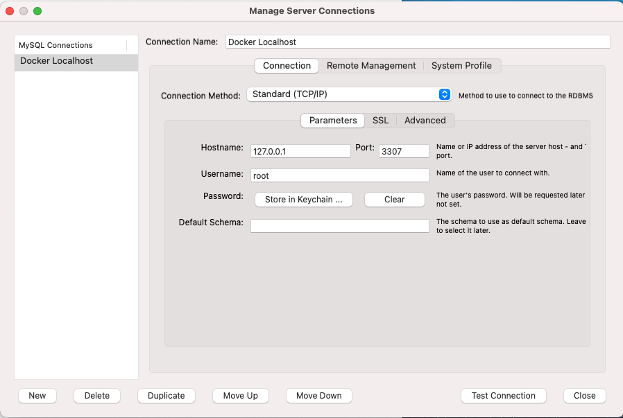

# @alcumus/services

A monorepo for Alcumus microservices


## Pre-requisites

Please make sure you have following node and npm versions installed. A higher node/npm version should still be fine.

- node: v14.15.5
- npm: v6.14.11

If you use `nvm`, then running `nvm use` will automatically set the correct node and npm versions.

Also install these tools as well:
* [MySQL Workbench](https://dev.mysql.com/downloads/workbench/)
* [MongoDB Compass](https://www.mongodb.com/try/download/compass)
* Either [Postman](https://www.postman.com/downloads/) or [Insomnia](https://insomnia.rest/download)
* Either Visual Studio Code or Webstorm or anything else you like

Here are some useful aliases you may want to use as well. Park these in `~/.bashrc` or `~/.zshrc` or as needed.

    alias whatami="git rev-parse --show-toplevel"
    alias bl="cd $(whatami) && npm run build"
    alias bb="cd $(whatami) && npm run bootstrap && npm run build"
    alias bs="cd $(whatami) && npm run build && npm run start"
    alias bbs="cd $(whatami) && npm run bootstrap && npm run build && npm run start"

(That should be a dollar sign not $)

## First Time Setup

```
git clone git@github.com:alcumus/services.git
cd services
npm ci
npm run bootstrap
npm run build
```

Now create a `.env` file at the root of monorepo and copy contents from `.env.example` into `.env` file

Continue running these commands now:
```
npm run docker:up # Runs docker containers in background
npm run seed # Creates databases and seeds records for any services that has "seed" command configured in services or packages
npm run start
```

## Monorepo commands

- `npm run docker:up`: Runs MongoDB, mySQL and Kong API Gateway in docker containers silently
- `npm run docker:down`: Stops containers started by `npm run docker:up`
- `npm run clean`: Cleans node_modules from all packages
- `npm run bootstrap`: This will install dependencies from all packages hoisting and symlinking node packages as required
- `npm run build`: Runs build in all packages
- `npm run start`: Runs `start` script across all services
- `npm run start-dev`: Runs `start-dev` script turning on debugging for development and will print service validation logs
- `npm test`: Runs tests in all packages
- `npm run seed`: Runs `seed` script found in any service or package within monorepo

## Testing the Installation

Things will work properly when:
* kong is setup correctly
* the mongo databases are created and seeded
* the server is running

## Setting up API Gateway locally

Konga is a front end for the Kong Gateway admin API, and it can be used to verify and make changes to your API gateway configurations. Currently, our Kong set-up is immature, so Konga also is our best way of removing bad configurations and adding scripts to re-add better.

**Steps to configure API Gateway locally:**

- Visit `http://localhost:1337`
- Create an account to work with Konga, it will stay local to your machine and you can choose any credentials.
- Once account is created, add connection to Kong using this url: `http://wildbreeze-kong:8001`
- Now if you go to `Services` and `Routes` you will find all required API gateway configuration preloaded there.


## Connection Configuration for SQLWorkbench:


## URLs to work with Monorepo

Service | URLs
--------|-----
API Gateway | `http://localhost:8000`
API Gateway Admin API | `http://localhost:8001`
Konga | `http://localhost:1337`
Auth Service | API Specs: `http://localhost:8000/auth/docs`<br />API Gateway URL: `http://localhost:8000/auth/api`<br />Direct Service URL: `http://localhost:8010/api`
High Fives Service | API Specs: `http://localhost:8000/high-fives/docs`<br />API Gateway URL: `http://localhost:8000/high-fives/api`<br />Direct Service URL: `http://localhost:8011/api`
Users Service | API Specs: `http://localhost:8000/users/docs`<br />API Gateway URL: `http://localhost:8000/users/api`<br />Direct Service URL: `http://localhost:8012/api`
Entity History Service | API Specs: `http://localhost:8000/entity-history/docs`<br />API Gateway URL: `http://localhost:8000/entity-history/api`<br />Local Direct Service URL: `http://localhost:8040/docs`
Safety Intelligence Service | API Specs: `http://localhost:8000/safety-intelligence/docs`<br />API Gateway URL: `http://localhost:8000/safety-intelligence/api`<br />Local Direct Service URL: `http://localhost:8014/docs`

## Managing dependencies

- To add a new dependency into a single package: `npx lerna add npmPackageName --scope=packageName`

  e.g. `npx lerna add dotenv --scope=auth-service`

- To add a new dependency into multiple packages: `npx lerna add npmPackageName --scope={packageName1, packageName2}`

  e.g. `npx lerna add dotenv --scope={auth-service,high-fives-service}`

- To drop a dependency from a package or service, just delete the row from package.json and run `npm run bootstrap` again.

- To accept the latest API Gateway setup when we change up infrastructure: `npm run firstTimeSetup`.  If you encounter errors, run it again.

- To re-seed the database, you can either drop the mongodb in docker or you can do it via the gui with Compass, then run `npm run seed`

## Publishing versions

We've customized Lerna's version commands to suit our needs. Lerna version command updates package.json, package-lock.json for all packages which have changed, and also adds git tags to the commit.

The git tags are used to determine the docker image tags. Docker image tags follow this pattern: `wildbreeze:[SERVICE]-[VERSION]`, and they're being pushed to an Elastic Container Repository.

Examples: `wildbreeze:auth-service-1.0.0`, `wildbreeze:users-service-1.0.0-beta.0`

- To create a new prerelease for all packages that have changes: `npx lerna version prerelease --preid=alpha`
- To create a new patch / minor / major version for all packages that have changes: `npx lerna version [patch | minor | major]`
- To bump version for all packages (force mode): `npx lerna version 1.2.0`
- To select what type of bump (patch / minor / major) is for each package, use the interactive mode: `npx lerna version`

The custom hooks setup will run tests before versioning, and push tags one by one to the repo so that the following caveat with GitHub Actions does not affect us: 

[GitHub Actions are not created when pushing more than 3 tags](https://github.community/t/webhook-limit-when-creating-more-than-3-tags/13720)

## Deployment

- Create a Virtual Machine somewhere
- Ensure the VM exposes port 80 to the outside world
- SSH into the machine and checkout the repository
- `cd .deploy`
- `./up.sh`

**When an update is available**
- SSH into the machine
- `cd services/.deploy`
- `git checkout master && git pull`
- `./up.sh`

Or, 

`ssh user@host 'cd services/.deploy && git checkout master && git pull && ./up.sh'`